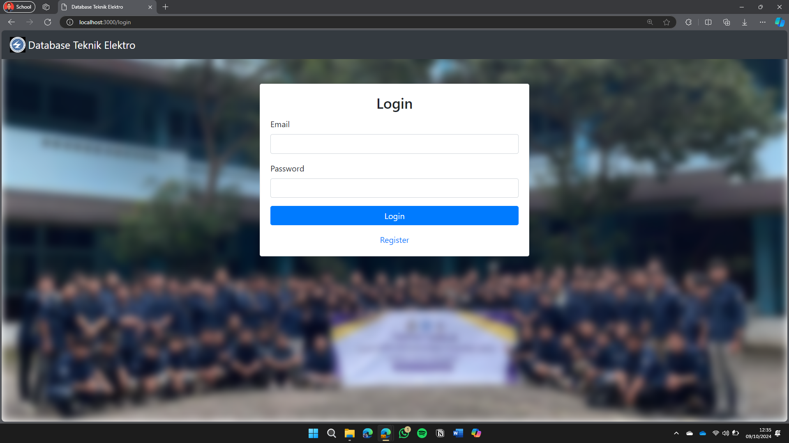
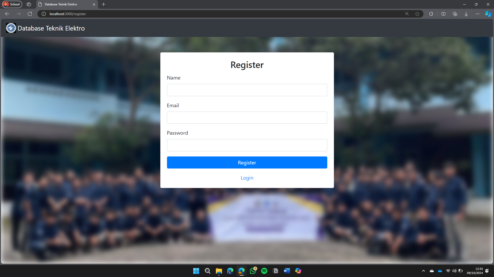
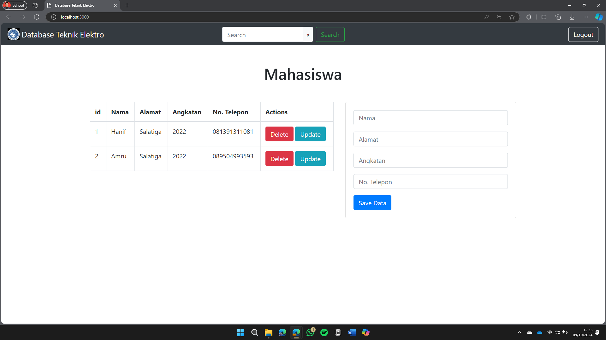
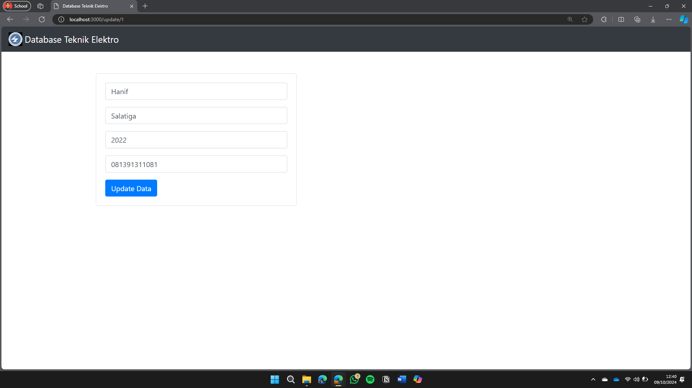
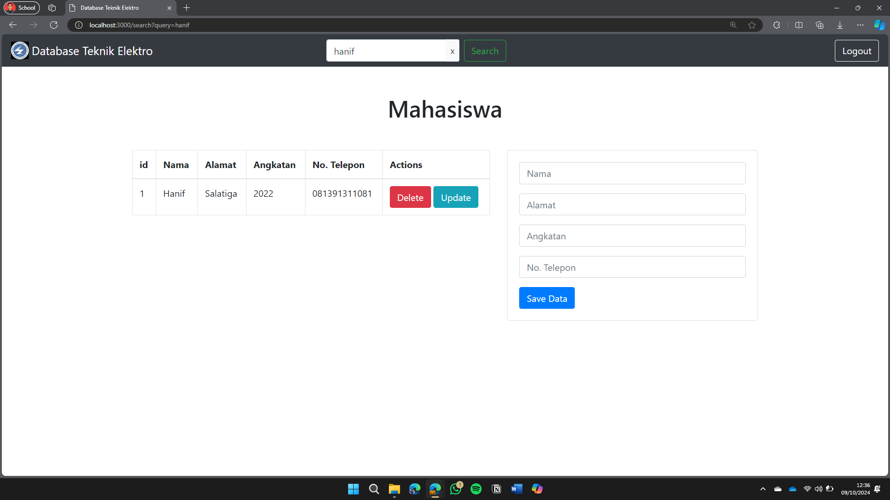

# Anggota Kelompok
- Farhan Hanif Rahmansyah (21060122120002)
- Muhammad Ridwan Slamat (21060122120006)
- Muhammad Afiq Ramadhan Oktaviyanto (21060122120010)

# Website Database Mahasiswa Teknik Elektro
Proyek ini adalah aplikasi web sederhana yang digunakan untuk mengelola data mahasiswa Teknik Elektro. Aplikasi ini memiliki fitur CRUD, yaitu memungkinkan pengguna untuk menambahkan (Create), melihat (Read), mengubah (Update), dan menghapus (Delete) data mahasiswa. Aplikasi ini dibangun menggunakan Node.js untuk menjalankan server, Express sebagai framework untuk mempermudah pengembangan, dan MySQL sebagai database untuk menyimpan data. Tujuan aplikasi ini adalah untuk mempermudah pengelolaan dan pencarian data mahasiswa dengan cara yang lebih cepat, efisien, dan mudah digunakan.

---

## Instalasi

Menginstal dependensi proyek:

```shell
npm ci
```
Buat database MySQL seperti pada file database/db.sql
Siapkan database MySQL Anda dan perbarui konfigurasi database di file app.js dan passport-config.js dengan kredensial Anda.

Jalankan aplikasi:

```shell
npm run dev
```

---

## Screenshot
Halaman Login


Halaman Register


Halaman Utama
- Menampilkan daftar mahasiswa yang sudah diinput
- Mengedit dan menghapus mahasiswa
- Melakukan pencarian


Halaman Update


Fungsi Search


---

## Keterangan
- Mengambil referensi dari https://github.com/TadeopCreator/crud-nodejs-mysql sebagai program utama CRUD lalu dikembangkan dengan menambahkan login dan register page dengan sesi, tombol logout, dan fitur pencarian
- Pada database crudnodejsmysql pada tabel customer berisikan data mahasiswa dan pada tabel user berisikan nama, email, dan password yang digunakan untuk autentikasi
